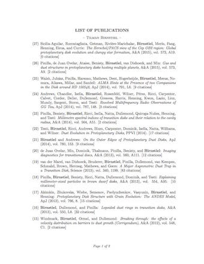

# Readme

This repository contains a script to create an authors publication list by  querying the [NASA ADS][ADS]. The output will be either LaTeX (just `\items` or a complete document) or the compiled PDF.

Here is an example:

The script can automatically include citation counts (`-c`) or open access information (`-oa`).

The [NASA ADS][ADS] query uses the [ADS developper API][API] for which you will need a dev key. The key needs to be specified by the option `-d` or as environment variable `ADS_DEV_KEY`. If you don't have a key, see [here](https://github.com/adsabs/adsabs-dev-api#signup--access).

## Non-unique authors

The script assumes the combination of first initial and last name to be a unique author. If this is not the case, you can further filter the results by ADS database (for example only `astronomy`). If this is not enough you can also use options `--year-start` and `--year-end` options to constrain the date range, or you need to use an ADS 2.0 personal library. In this case your library will have a long string name like `3c1ffb0f-728c-4780-b78c-6e7c4d08997d`. You can find this ID if you go to your ADS 2.0 account, then to Libraries, then to the admin page of your library and then scroll to the bottom where it will say:

> Delete this library 3c1ffb0f-728c-4780-b78c-6e7c4d08997d/library:example

Use the string before `/library` with the `--library-id` option.

## More help

For more description about the available options, call the help using the `-h` option.

[ADS]: http://adsabs.harvard.edu
[API]: https://github.com/adsabs/adsabs-dev-api